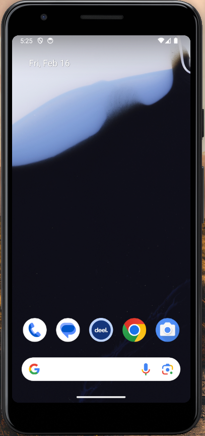
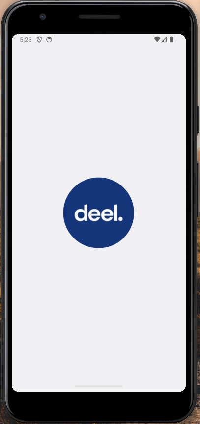
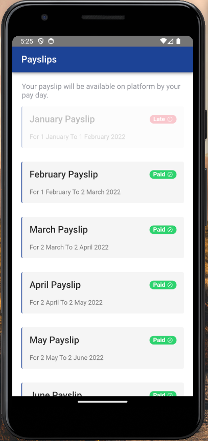
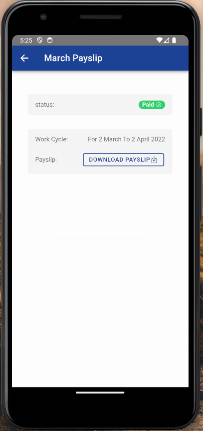
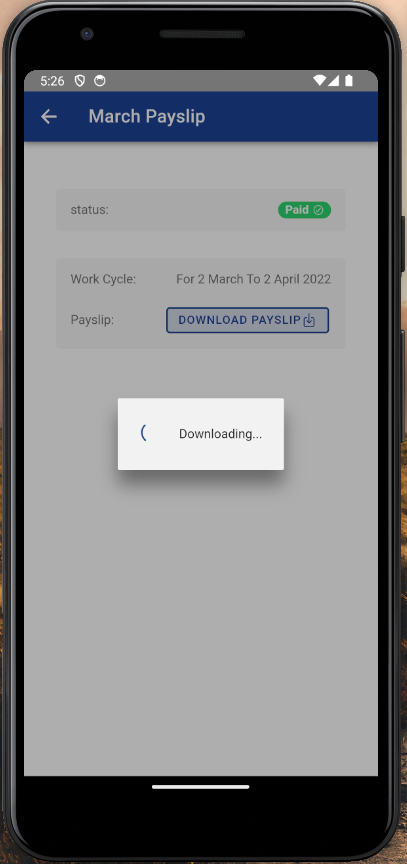
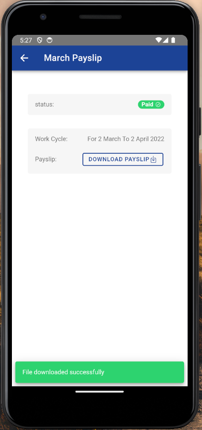

show me how this will reflect in github

# Payslips-Cross-Platform-Application

This is an Ionic Capacitor React Project

# Add native platforms

```bash
ionic build
ionic cap add ios
ionic cap add android
ionic cap sync
```

# Add Permissions for Native

in IOS go to `Info.plist` file and Add

```bash
<key>NSFileProviderDomainAllVolumes</key>
<true/>
```

in Android go to `AndroidManifest.xml` and add

```bash
<uses-permission android:name="android.permission.READ_EXTERNAL_STORAGE"/>
<uses-permission android:name="android.permission.WRITE_EXTERNAL_STORAGE"/>
```

then run

```bash
 ionic cap sync
```

run on web 
```bash
ionic serve
```

run on Andriod 
```bash
ionic capacitor run android --livereload --external
```

run on Ios 
```bash
ionic capacitor run ios --livereload --external
```

## Preview


<div style="display: flex; flex-direction: 'row' ;margin-bottom:15px; justify-content: space-between;">




</div>
<div style="display: flex; flex-direction: 'row' ;margin-bottom:5px; justify-content: space-between;">





</div>